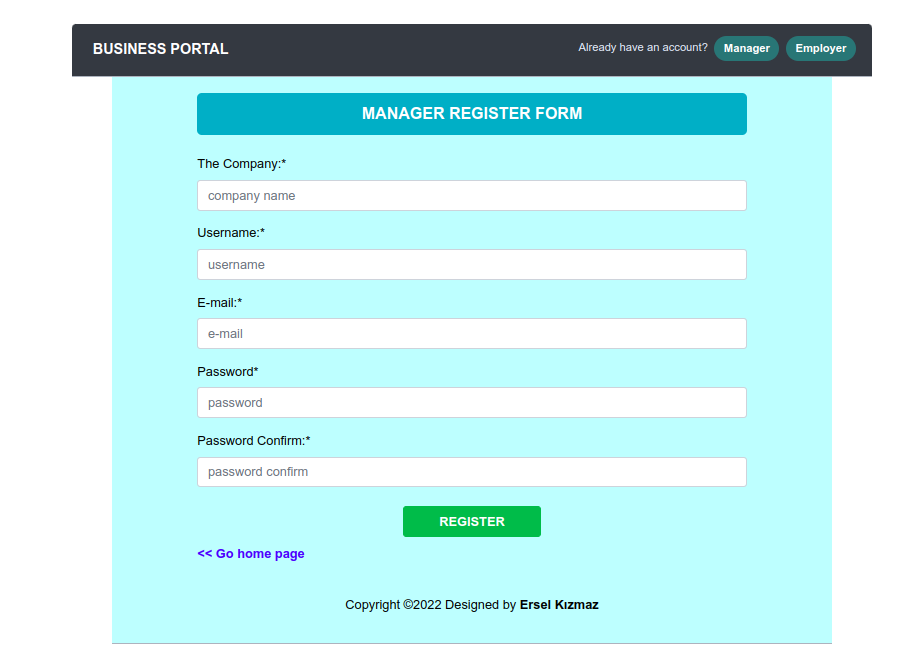
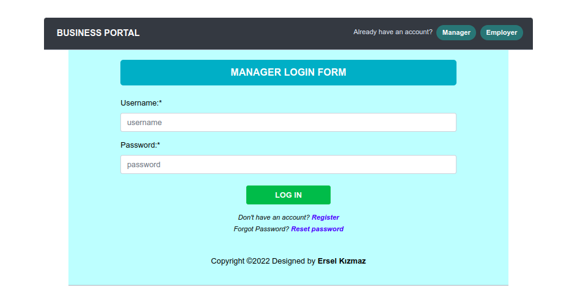
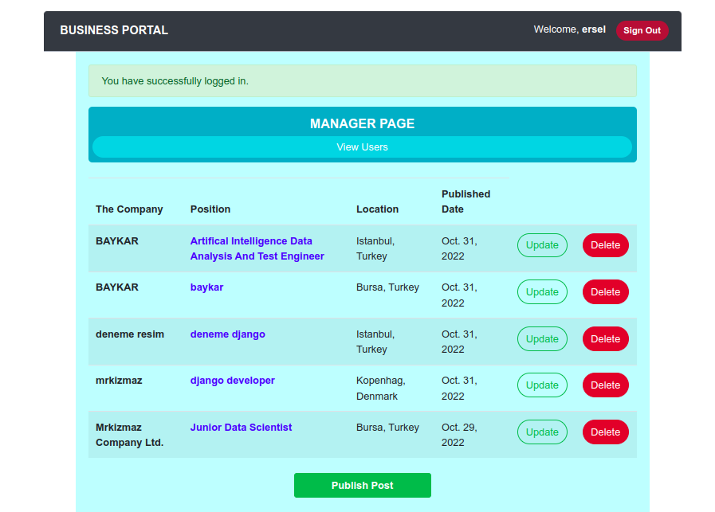
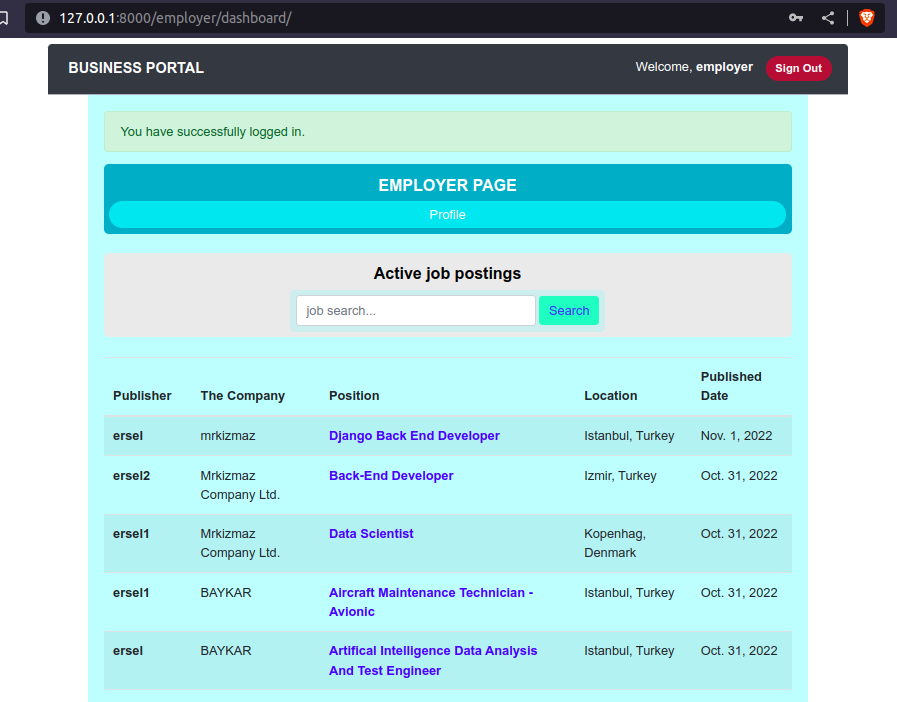

# Business-Project-with-Django
> Bu proje, farklı alanlardan oluşan iş ilanlarını tek bir platformda toplama ve kullanıcıların ilgilendikleri pozisyonları kolay bir şekilde bulmasına yardımcı olmak için geliştirilmiştir.

<h3>Projede Kullanılan Teknolojiler</h3>
<ul>
<li>Back-end tasarımı için: <b>Python (Django)</b></li>
<li>Verileri veritabanına kaydetmek için: <b>PostgreSQL</b></li>
<li>Front-end tasarımı için: <b>HTML ve CSS</b></li>
<li>Botstrap kaynakları için: <b>JS</b></li>
</ul>

<h3>Projenin Geliştirme Aşamaları</h3>
<ul>
<li>[x] Projeyi Django ortamında başlatma ve PostgreSQL veritabına bağlanma işlemleri</li>
<li>[x] İlgili modellerin tabloları oluşturulup veri tabanına kaydedilmesi</li>
<li>[x] Front-end tasarımının oluşturulması</li>
<li>[x] Back-end tasarımının ayarlanması</li>
<li>[ ] Projeyi yayına alma</li>
</ul>

<h3>Projenin Kullanım Detayları</h3>

<ol>
<li>Projenin anasayfası, yönetici ve iş arayan için iki farklı kayıt olma (`register`) butonu vardır. İlgili kullanıcılar kayıt olmak için butonlara tıklayarak kayıt sayfasına yönlendirilir. Ayrıca, kullanıcı daha önce kayıt yapmış ise siteye giriş yapmak için sağ üstteki butonlara tıklamaları yeterlidir.</li>  

  
<i>Web sitesi ana sayfa</i>

<li>Kullanıcılar için kayıt ekranı, sayfada görülen her alanı başarılu bir şekilde doldurdaktan sonra kullanıcılar siteye kayıt edilir.</li>  

  
<i>Yönetici kayıt sayfası, iş arayan için; <a href"images/05_register_employer_page.png">employer</a></i>

<li>Başarılı bir şekilde kayıt olan kullanıcılar, giriş sayfasına gerekli bilgileri girerek siteye giriş yapabilirler.</li>  

  
<i>Giriş sayfası</i>

<li>Siteye giriş yapan yönetici yayınladığı iş ilanlarını görüntüleyebilir, güncelleyebilir, silebilir ve yeni bir iş ilanı oluşturabilir. Ayrıca ilgili pozisyonlara başvuru yapanları görüntülebilir.</li>  

  
<i>Yöneticiler için dashboard</i>

<li>İş arayan kullanıcılar siteye giriş yaptıktan sonra firmalar tarafından yayınlanan tüm iş ilanlarını görüntüleyebilir, ilgilendiği pozisyonları filtreleyerek istediği ilanlara başvuru yapabilir. Ayrıca profilini veri ekleyip veya silerek güncelleyebilir.</li>  

  
<i>İş arayanlar için dashboard</i>

</ol>  

<ul>
<li>
Projenin detaylı ek resimleri için ilgili <a href="https://github.com/mrkizmaz/Business-Project-with-Django/tree/main/images">images</a> sayfasını ziyaret edebilirsiniz.

</li>
</ul>