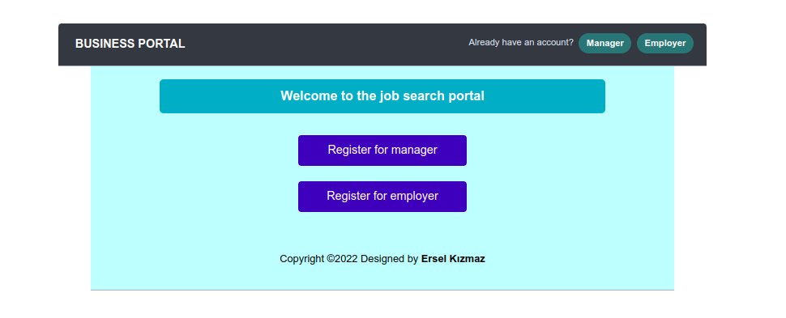

# Business-Project-with-Django
> Bu proje, farklı alanlardan oluşan iş ilanlarını tek bir platformda toplama ve kullanıcıların ilgilendikleri pozisyonları kolay bir şekilde bulmasına yardımcı olmak için geliştirilmiştir.

<h3>Projede Kullanılan Teknolojiler</h3>
<ul>
<li>Back-end tasarımı için: <b>Python (Django)</b></li>
<li>Verileri veritabanına kaydetmek için: <b>PostgreSQL</b></li>
<li>Front-end tasarımı için: <b>HTML ve CSS</b></li>
<li>Botstrap kaynakları için: <b>JS</b></li>
</ul>

<h3>Projenin Geliştirme Aşamaları</h3>
<ul>
<li>[x] Projeyi Django ortamında başlatma ve PostgreSQL veritabına bağlanma işlemleri</li>
<li>[x] İlgili modellerin tabloları oluşturulup veri tabanına kaydedilmesi</li>
<li>[x] Front-end tasarımının oluşturulması</li>
<li>[x] Back-end tasarımının ayarlanması</li>
<li>[] Projeyi yayına alma</li>
</ul>

<h3>Projenin Kullanım Detayları</h3>
<ol>
<li>Projenin anasayfası, yönetici ve iş arayan için iki farklı kayıt olma (`register`) butonu vardır. İlgili kullanıcılar kayıt olmak için butonlara tıklayarak kayıt sayfasına yönlendirilir. Ayrıca, kullanıcı daha önce kayıt yapmış ise siteye giriş yapmak için sağ üstteki butonlara tıklamaları yeterlidir.</li>

<li></li>
<li></li>
<li></li>
<li></li>
<li></li>
<li></li>
<li></li>
<li></li>
<li></li>
<li></li>
<li></li>
</ol>

